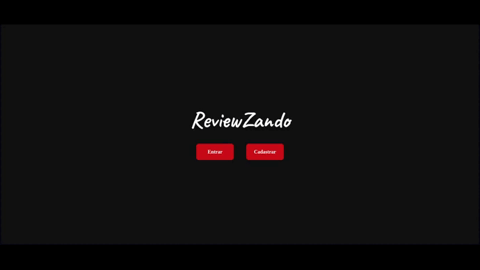

# 
ReviewZando

 

 

## ✏️ Description

ReviewZando is an application used to create movie reviews and share them with your followers.

 

##  
 :white_circle: Tecnologias

- [HTML](https://developer.mozilla.org/pt-BR/docs/Web/HTML)
- [Styled Components](https://styled-components.com/)
- [JavaScript](https://developer.mozilla.org/pt-BR/docs/Web/JavaScript)
- [TypeScript](https://www.typescriptlang.org/docs/)
- [React](https://reactjs.org/)
- [Node.Js](https://nodejs.org/en/docs)
- [Jest](https://jestjs.io/pt-BR/docs/getting-started)
- [Prisma](https://www.prisma.io/docs)
- [PostgreSQL](https://www.postgresql.org/docs/)
- [Vite](https://vitejs.dev)
- [Docker](https://www.docker.com)

 
